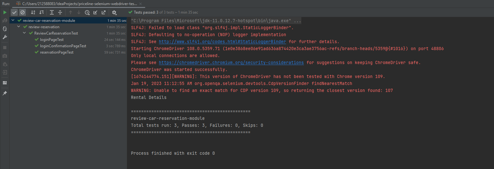

# hertz-selenium-webdriver-tests
This project makes use of selenium WebDriver to automate login and car reservation review page for Enterprise car rental (https://www.enterprise.com/en/home.html).

## Pre-requisites
Download cromedriver from https://chromedriver.chromium.org/downloads and place it at a location on your computer and set the location in ReviewCarReservationTest.java file

### Running the tests
Clone this repository
Navigate to testng.xml file and run the test suite

#### Successful run of the test

Video recording: https://www.dropbox.com/s/slo42esawuxbk2l/IMG_1141.MOV?dl=0